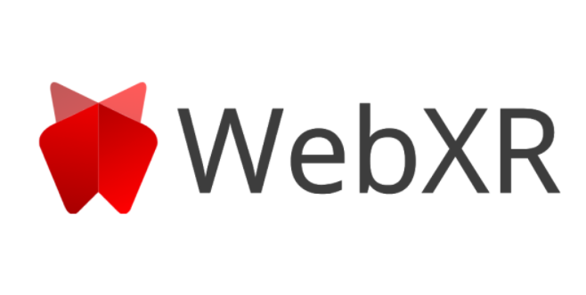

# Plantilla de Trabajo para WebXR con AR
El repositorio cuenta con dos opciones

 - React & Three.js (Vanilla)
 - React & @React-Three/Fiber - @React-Three/XR - @React-Three/Drei
  
 Para mas informacion 
 https://docs.microsoft.com/en-us/windows/mixed-reality/develop/javascript/webxr-overview

## Tutorial
Youtube

## Instalación
No te olvides utilizar el siguiente comando para la instalación de las librerías usadas
- npm install

## Tecnologías 
- [React](https://es.reactjs.org/)
- [Three.js](https://threejs.org/)
- [@React-Three/Fiber](https://github.com/pmndrs/react-three-fiber)
- [@React-Three/Drei](https://github.com/pmndrs/drei)
- [@React-Three/XR](https://github.com/pmndrs/react-xr)

## Demo 
- https://vrexperience-cdab2.web.app/
